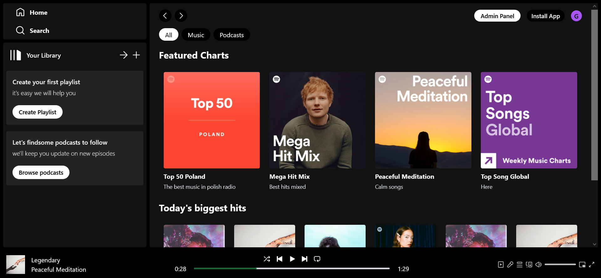

<h1 align="center">Spotify Clone MERN</h1>

 The live link can be found here - [Spotify Clone](https://spotify-mern-frontend.onrender.com/)

*** 

## Contents
* [About The Project](#about-the-project)
    * [Description](#description)
    * [Built With](#build-with)
* [Project Goals and UX](#project-goals-and-ux)
    * [Project Goals](#Project-Goals)
    * [User Stories](#User-Stories)
    * [Admin User Stories](#Admin-user-stories)
<!-- * [Design](#Design)
    * [Wireframes](#Wireframes)
    * [Colour Scheme](#Colour-Scheme)
    * [Fonts](#Fonts) -->
* [Features](#Features)
    * [Features](#Features)
    * [Future Features](#Future-Features)
* [Testing](#Testing)
    * [Accessibility Testing](#Accessibility-Testing)
    * [Manual Testing](#Manual-Testing)
* [Deployment](#Deployment)
    * [Cloning & Forking](#Cloning-&-Forking)
    * [Remote Deployment](#Remote-Deployment)

***
## About The Project

### Description

The Spotify Clone project is a web application that replicates the core functionality of the popular music streaming service Spotify. The application allows users to browse and play music, create and manage playlists.

### Built With

 #### <b>MERN</b> Stack 

 [![MongoDB][Mongodb]][Mongodb-url] [![Express][Express]][Express-url] [![React][React.js]][React-url] [![Node][Node]][Node-url]

#### Styles

[![Tailwind][Tailwind]][Tailwind-url]

## Project Goals and UX

### Project Goals
* The Goal of the project is to make an real-time music player for the learning purposes.

* It has been designed for people who want to keep coming back to enjoy their favorite music.

### User Stories
|Story No.|Story|
| ------------- | ------------- |
|1|As an user,   I want to be able to play the music  so that I can listen to my favorite songs.   I know I am done when the user can play the music from Player or by clicking on song on Home screen. |
|2|As an user,   I want to be able to pause the music  so that I can come back and continue my listening.   I know I am done when the user can pause the music in the Player. |
|3|As an user,   I want to be able to play previous/next song  so that I can repeat or skip the song I want.   I know I am done when Player's previous/next buttons  are working as desired. |
|4|As an user,   I want to be able to open the Album details  so that I can see what I can listen to.  I know I am done when user is navigated to Album item  after clicking on it. |
|5|As an user,   I want to be play any song by clicking on it on Home screen  so that will make it simple.  I know I am done when music plays after user clicked on  any song on Home screen. |

### Admin User Stories
|Story No.|Story|
| ------------- | ------------- |
|1|As an admin,   I want to be able to add new song  so that I can listen to whatever I like.   I know I am done when user receive a toast message  on top-right of Admin Panel after succesfully adding  new song. |
|2|As an admin,   I want to be able to list all my songs  so that I can organise my songs.   I know I am done when user get all the songs listed  after navigating to List Songs in Admin Panel. |
|3|As an admin,   I want to be able to create an album  so that I can add the songs to it.   I know I am done when user receive a toast message  on top-right of Admin Panel after succesfully adding  new album. |
|4|As an admin,   I want to be able to list all my albums  so that I can organise my albums.   I know I am done when user get all the albums listed  after navigating to List Album in Admin Panel. |
|5|As an admin,   I want to be able to delete song and playlist  so that I can rid out whats unwanted.  I know I am done when the Remove button   in Admin Panelworks succesfully. |

## Features

### Spotify Player

Desktop - <b>CLICK</b> to see

#### Display | Home Page

#### Album Page

#### Sidebar

#### Navbar

#### Player

Mobile - <b>CLICK</b> to see

#### Display | Home Page

#### Album Page

### Admin Panel

Desktop Admin - <b>CLICK</b> to see

#### Add Song

#### List Songs

#### Add Album

#### List Albums

Mobile Admin - <b>CLICK</b> to see

#### Add Song

#### List Songs

#### Add Album

#### List Albums

---

### Future Features 

* Authentication
* Player with full functionality
* Sidebar expanded
* Navbar expanded

## Testing

### Accessibility Testing
#### Lighthouse

### Manual Testing
- I have tested that this page works in different web browsers.
- I have tested that the project is responsive and works with different device sizes. Looks good and functions as usual. 
- I have tested all links, internal and external. They go to the correct destination and open in the correct way. 
- I have tested that all text and fonts are readable and easy to understand.
- I have tested that the correct data is passed when the forms are submitted. 
- I have tested that the Play/Pause & Prev/Next buttons are correctly working in Player component.
- I have tested that the user can play a song from the Display component or Album item component.
- I have tested that Player seekbar working correctly with regard to song duration.
- I have tested that user can add the song in Admin Panel.
- I have tested that user can list all the songs in Admin Panel.
- I have tested that user can add the album in Admin Panel.
- I have tested that user can list all the albums in Admin Panel.
- I have tested that user can remove song and album in Admin Panel.

## Deployment

### Cloning & Forking
#### Fork
1. On GitHub.com, navigate to the [nil1143/spotify-mern](https://github.com/nil1143/spotify-mern) repository.
2. In the top-right corner of the page, click Fork.
3. By default, forks are named the same as their parent repositories. You can change the name of the fork to distinguish it further.
4. Add a description to your fork.
5. Click Create fork.

#### Clone
1. Above the list of files click the button that says 'Code'.
2. Copy the URL for the repository.
3. Open Terminal. Change the directory to the location where you want the cloned directory.
4. Type git clone, and then paste the URL.
5. Press Enter.

### Remote Deployment
 The site was deployed to Github pages. If you have forked/cloned the repository the steps to deploy are:
 1. On GitHub.com, navigate to your repository.
 2. Navigate to the settings tab.
 3. Click on the tab called 'pages' on the left hand side.
 4. From the source drop down list under the heading Build and deployment, select main.
 5. The page will hten provide the link to the website.
 
 
 
 

[![Github][Github]][Github-url] [![LinkedIn][LinkedIn]][Linkedin-url]

<!-- MARKDOWN LINKS & IMAGES -->
[Mongodb]: https://img.shields.io/badge/-MongoDB-black.svg?style=for-the-badge&logo=mongodb&colorB=555
[Mongodb-url]: https://www.mongodb.com/atlas
[Express]: https://img.shields.io/badge/-express-white.svg?style=for-the-badge&logo=express&colorB=333
[Express-url]: https://expressjs.com/
[React.js]: https://img.shields.io/badge/React-20232A?style=for-the-badge&logo=react&logoColor=61DAFB
[React-url]: https://reactjs.org/
[Node]: https://img.shields.io/badge/node-black.svg?style=for-the-badge&logo=nodedotjs&colorB=333
[Node-url]: https://nodejs.org/
[Github]: https://img.shields.io/badge/github-black.svg?style=for-the-badge&logo=github&colorB=333
[Github-url]: https://github.com/nil1143
[LinkedIn]: https://img.shields.io/badge/-LinkedIn-black.svg?style=for-the-badge&logo=linkedin&colorB=555
[LinkedIn-url]: https://www.linkedin.com/in/tomasz-nilipiuk-b5b88a239/
[Tailwind]: https://img.shields.io/badge/Tailwind-blue.svg?style=for-the-badge&logo=tailwind-css&colorB=EFEFFF
[Tailwind-url]: https://tailwindcss.com/
